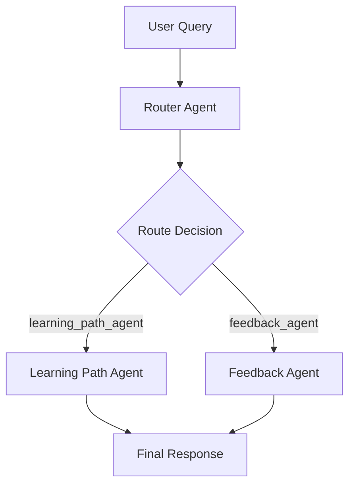

# 🎓 Intelligent Course Recommender with Multi-Agent Q&A System

This project is a Streamlit-based web application that provides personalized course recommendations and a sophisticated multi-agent learning assistant for interactive Q&A. It combines OpenAI embeddings, semantic similarity search, and a **multi-agent system powered by LangGraph** to guide learners in selecting the most suitable courses and exploring structured learning paths.

## 🚀 Features

### Course Recommendations
- Uploads and filters courses from a JSON dataset (course.json)
- Embeds user profile and course descriptions using OpenAI embeddings
- Ranks courses by cosine similarity between user preferences and course embeddings
- Semantic reranking using sentiment_score
- Interactive UI for filtering by platform, difficulty, duration, and cost

### 🤖 Multi-Agent Q&A System
The application features a sophisticated multi-agent architecture built with **LangGraph** that intelligently routes user queries to specialized agents:

#### **Router Agent** 🧭
- **Purpose**: Analyzes incoming user queries and routes them to the appropriate specialized agent
- **Decision Logic**: Uses GPT-4o-mini to classify queries as either:
  - `learning_path_agent`: For course recommendations, career paths, skills development
  - `feedback_agent`: For course feedback and reviews
- **Fallback**: Defaults to learning_path_agent for ambiguous queries

#### **Learning Path Agent** 📚
- **Purpose**: Handles educational guidance and course recommendations
- **Capabilities**:
  - Provides personalized learning path suggestions
  - References top recommended courses from the recommendation engine
  - Offers career guidance and skill development advice
  - Incorporates course feedback data when available
- **Context Awareness**: Uses chat history (last 3 turns) for contextual responses

#### **Feedback Agent** 💬
- **Purpose**: Processes and stores user feedback about courses
- **Workflow**:
  1. Parses natural language feedback (e.g., "satwik, c_id - c002, this course is amazing")
  2. Converts to structured JSON format with fields:
     - `student_name`: Extracted from feedback text
     - `course_id`: Course identifier
     - `like/dislike`: Boolean sentiment flags
     - `comment`: Original feedback text
  3. Saves feedback to `feedback.json`
  4. Updates course sentiment scores in `course.json`

#### **Agent State Management**
The system uses a shared `AgentState` dataclass that maintains:
- User query and profile information
- Top course recommendations
- Chat history for context
- Agent routing decisions
- Final responses

#### **LangGraph Workflow**


### Streamlit Interface
- Sidebar filters for courses
- Real-time recommendations
- Chat interface with multi-agent responses
- Chat history viewer
- Agent status indicators

## 📂 Project Structure
```
.
├── course.json          # Dataset of available courses
├── feedback.json        # JSON file storing course feedback
├── multi_Agent.py       # Multi-agent system logic (integrated)
├── app.py               # Main Streamlit app with multi-agent system
├── requirements.txt     # Python dependencies
└── README.md            # Documentation
```

## ⚙️ Setup & Installation

### 1. Clone Repository
```bash
git clone https://github.com/your-repo/course-recommender.git
cd course-recommender
```

### 2. Create Virtual Environment
```bash
python -m venv .venv
source .venv/bin/activate   # Mac/Linux
.venv\Scripts\activate      # Windows
```

### 3. Install Dependencies
```bash
pip install -r requirements.txt
```

**Example requirements.txt:**
```txt
streamlit
openai
scikit-learn
numpy
langgraph
langchain-openai
langchain-core
```

### 4. Prepare Course Data
- Add your `course.json` dataset (course metadata with title, description, provider, duration, etc.)
- Ensure `feedback.json` exists (can be empty list `[]` initially)

### 5. Set OpenAI API Key
Either set in `.streamlit/secrets.toml`:
```toml
OPENAI_API_KEY = "your_api_key_here"
```
Or enter interactively in the app.

## ▶️ Run the Application
```bash
streamlit run app.py
```
Then open the provided local URL (default: http://localhost:8501) in your browser.

## 🧠 How It Works

### Course Embeddings
- Uses `text-embedding-3-small` model to encode course metadata
- Matches against user profile embedding (background, interests, goals, skills)
- Computes cosine similarity to rank courses

### Semantic Reranking
- Courses are reranked by a `sentiment_score` field (if available) for better quality ordering

### Multi-Agent Processing Flow
1. **Query Reception**: User submits a question through the chat interface
2. **Router Analysis**: Router agent analyzes the query using GPT-4o-mini
3. **Agent Selection**: Routes to appropriate specialist agent
4. **Context Integration**: Selected agent processes query with:
   - User profile information
   - Top recommended courses
   - Previous chat history
   - Available course feedback
5. **Response Generation**: Agent generates contextual, personalized response
6. **State Management**: Updates chat history and system state

### Feedback Processing
- Natural language feedback is automatically parsed and structured
- Sentiment scores are updated in real-time
- Feedback influences future course recommendations

## 📝 Example Usage

### Input Profile:
```
Background: Final-year CS student
Interests: AI, Data Science
Goals: Become an ML Engineer
Skills: Python - intermediate, Math - beginner
```

### Filters:
- Platform: Coursera, Udemy
- Difficulty: Beginner, Intermediate
- Duration: ≤ 80 hours
- Cost: Free + Paid

### Multi-Agent Interactions:

**Learning Path Query:**
```
User: "Which course helps me with deep learning basics?"
Router: → learning_path_agent
Assistant: "Based on your profile as a CS student interested in ML engineering, 
I recommend starting with 'Deep Learning Specialization' by DeepLearning.AI on Coursera. 
Given your intermediate Python skills, this course will..."
```

**Feedback Submission:**
```
User: "john_doe, c_id - c003, this course was excellent for beginners"
Router: → feedback_agent
Assistant: "Feedback saved successfully."
[System automatically updates sentiment score for course c003]
```

## 🏗️ Technical Architecture

### Multi-Agent System Components
- **StateGraph**: LangGraph workflow orchestration
- **Conditional Routing**: Dynamic agent selection based on query type
- **Shared State**: Persistent state across agent interactions
- **Context Management**: Maintains conversation history and user context

### Data Flow
1. User input → Router Agent (query classification)
2. Specialized Agent → Context integration + LLM processing
3. Response generation → State update → User interface

## 📌 Notes

- ✅ OpenAI API key required for embeddings and LLM functionality
- ✅ Works best with a well-curated `course.json` dataset
- ✅ `feedback.json` stores and accumulates user feedback dynamically
- ✅ Multi-agent system provides specialized, contextual responses
- ✅ LangGraph enables sophisticated workflow orchestration
- ✅ Real-time sentiment analysis improves recommendation quality

## 🔧 Customization

### Adding New Agents
To add a new specialized agent:
1. Create agent class following the existing pattern
2. Update `RouterAgent` to recognize new query types
3. Add node to the LangGraph workflow
4. Update conditional routing logic

### Extending Functionality
- Add new course metadata fields
- Implement additional filtering options
- Integrate with external learning platforms
- Add user authentication and personalized profiles

## 🤝 Contributing

1. Fork the repository
2. Create a feature branch (`git checkout -b feature/new-agent`)
3. Commit your changes (`git commit -am 'Add new specialized agent'`)
4. Push to the branch (`git push origin feature/new-agent`)
5. Create a Pull Request

## 📄 License

This project is licensed under the MIT License - see the LICENSE file for details.

---

**Built with ❤️ using Streamlit, OpenAI, and LangGraph**
